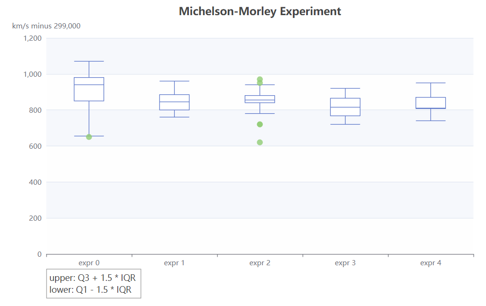
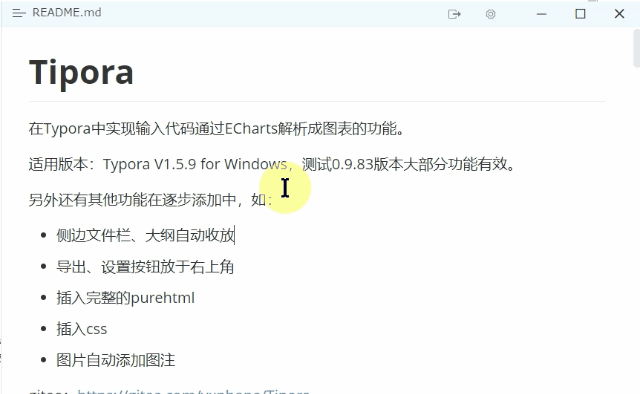
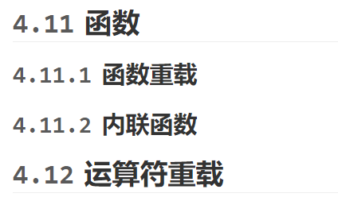

# Tipora

在Typora中实现输入代码通过ECharts解析成图表的功能。

适用版本：Typora V1.5.9 for Windows，测试0.9.83版本大部分功能有效。

另外还有其他功能在逐步添加中，如：

- 侧边文件栏、大纲自动收放
- 导出、设置按钮放于右上角
- 插入完整的purehtml
- 插入css
- 图片自动添加图注

gitee：https://gitee.com/yxphope/Tipora

guthub: [Tipora](https:// github.com/yxphope/Tipora)

<font color="blue">在Typora中实现输入代码通过ECharts解析成图表的功能</font>

## 安装

1. 下载 `echarts.min.js`和 `parsecharts`文件，保存至Typora安装目录下或其他合适位置
2. 打开 `C:\Program Files\Typora\resources\window.html`（或者你的自定义安装目录下的该文件），在文件末尾 `</html>`前添加如下语句（前后顺序不能换，注意 `file://`以及路径分隔符用 `/`）

   ```html
   <script src="file://D:/yourSavePath/echarts.min.js"></script>
   <script src="file://D:/yourSavePath/parsecharts.js"></script>
   ```
3. 重新启动Typora即可输入相关语法。

或者您也可以编辑 `D:\Program Files\Typora\resources\appsrc\window\frame.js`，在最后加入下载的两个文件的内容。

较低版本的Typora请手动

### 导出PDF、HTML

文件->偏好设置->导出->PDF->插入额外内容

```html
<style>
body {margin:0 !important;padding:0 24px !important;} /*个人设置，可以去除*/
.md-diagram-panel-preview, svg {page-break-inside: avoid;} /*防止图像被分隔在两页*/
</style>
<script src="file://D:/Infinate/Project/mdECharts/echarts.min.js"></script>
<script>var MDexport = true;// 导出时需要立即绘制、禁用动画</script>
<script src="file://D:/Infinate/Project/mdECharts/parsecharts.js"></script>
```

文件->偏好设置->导出->PDF->在\<body/>中添加以上内容

## 功能

### 1. 绘制echarts内容

```
```echarts
option // 第一行为必须项
// JavaScript 代码(已压缩)
option={title:[{text:'Michelson-Morley Experiment',left:'center'},{text:'upper: Q3 + 1.5 * IQR \nlower: Q1 - 1.5 * IQR',borderColor:'#999',borderWidth:1,textStyle:{fontWeight:'normal',fontSize:14,lineHeight:20},left:'10%',top:'90%'}],dataset:[{source:[[850,740,900,1070,930,850,950,980,980,880,1000,980,930,650,760,810,1000,1000,960,960],[960,940,960,940,880,800,850,880,900,840,830,790,810,880,880,830,800,790,760,800],[880,880,880,860,720,720,620,860,970,950,880,910,850,870,840,840,850,840,840,840],[890,810,810,820,800,770,760,740,750,760,910,920,890,860,880,720,840,850,850,780],[890,840,780,810,760,810,790,810,820,850,870,870,810,740,810,940,950,800,810,870]]},{transform:{type:'boxplot',config:{itemNameFormatter:'expr {value}'}}},{fromDatasetIndex:1,fromTransformResult:1}],tooltip:{trigger:'item',axisPointer:{type:'shadow'}},grid:{left:'10%',right:'10%',bottom:'15%'},xAxis:{type:'category',boundaryGap:true,nameGap:30,splitArea:{show:false},splitLine:{show:false}},yAxis:{type:'value',name:'km/s minus 299,000',splitArea:{show:true}},series:[{name:'boxplot',type:'boxplot',datasetIndex:1},{name:'outlier',type:'scatter',datasetIndex:2}]};
```



### 2. 界面调整

- 侧边栏自动收放
- 导出、设置按钮设置在右上角，方便快捷

<video src="./README.assets/WinCam-2023-04-15-%5B02-05-45%5D.mp4"></video>



### 3. 编写HTML

Typora本身会对我们编写的html代码进行一些处理，比如class、id等等很多属性会被屏蔽，少有能用的有style属性。使用purehtml代码块编写的html将原封不动地写入到DOM文档中。

````
```purehtml
<div class></div>
```
````

### 4. 编写css样式

添加一段代码语言为style的代码即可写css样式，每5s应用一次。只会应用第一个style，建议放在开头。

- h1, h2, h3自动编号

```
```style
#write {counter-reset: h1;}
#write h1 {
	counter-reset: h2;
}
#write h2 {
	counter-reset: h3;
}
#write h1:before {
	counter-increment: h1;
	content: counter(h1)
}
#write h2:before {
	counter-increment: h2;
	content: counter(h1) "." counter(h2)
}
#write h3:before {
	counter-increment: h3;
	content: counter(h1) "." counter(h2) "." counter(h3)
}
h1:before, h2:before, h3:before{
	color: #5A5A5A;
	margin-right:10px;
}
```

效果如下

 

同时，通过在设置开启typora的调试模式，右键检查元素，即可像浏览器一样审查元素，并按需要添加任何样式。

- 图片自动编号

目前支持img和svg标签

插件内置了对图片自动编号的功能（在img、svg后插入一个带有alt属性的p元素），默认未开启显示，添加以下代码即可。

```css

body {
    counter-reset: Figures;
    --figPre: "图";
	--figSuf: " ";
}
#write p .md-image.md-img-loaded:only-child {
	display:block;
	margin:auto;
}
#write img+p:before, #write svg+p:before {
	counter-increment: Figures;
	content: var(--figPre, "Fig") counter(h1) "." counter(h2) "." counter(h3) "-" counter(Figures) var(--figSuf," ") attr(alt);
	display: block;
	text-align: center;
	margin-top: 4px;
	margin-bottom: 10px;
}
```

例如：

\!\[Title](path) 将显示 [counter] 标题

\

\<svg alt="1">\<title>This is the TITLE\</title>\</svg>

- 字体样式，等等，全部可以自由设置
